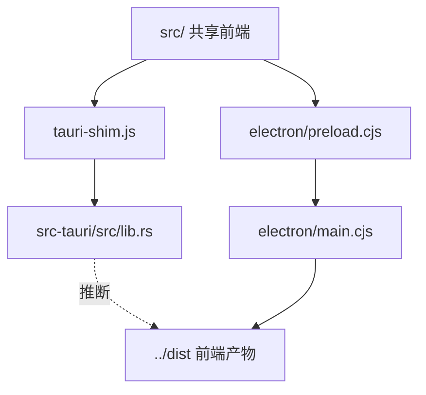
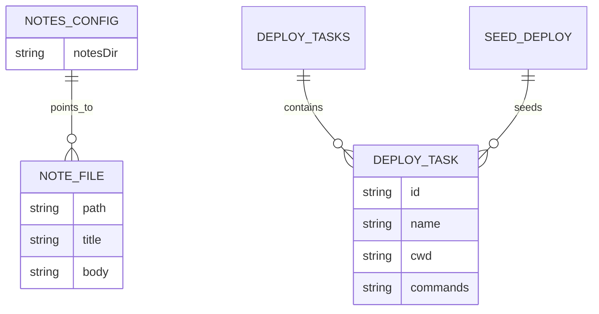
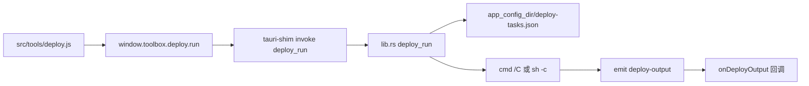

# DevToolbox 项目结构总览

> 本地图由 Pathfinder(领航)生成,供 impact 当 L1 导航上下文。
> 地图只是**导航参考，不是权威依据**:`【推断】`项动手前必须重新取证。

## 概览摘要（30 秒读懂）

> 本节为人类快速认知设计。impact 读取时跳过本节,从【0】开始。

**一句话**：DevToolbox 是面向开发者的桌面工具箱（JSON/加解密/SSH/部署等），主路径是 Electron + Vite 前端，并行实现了 Tauri 2 壳（`src-tauri`，整目录尚未纳入 Git）。
证据：【已核实: README.md + package.json + src-tauri/Cargo.toml + git status `?? dev-toolbox/src-tauri/`】

**Quick Start（5 步跑起来）**：
1. 进入 `dev-toolbox/`，执行 `npm install`
2. 配置环境变量：未发现必需 env 文件（Electron 镜像在 script 内用 `ELECTRON_MIRROR`）
3. 初始化数据库：无数据库
4. 启动开发服务：Electron 主路径 `npm run dev`；仅前端 `npm run dev:web`；Tauri 无 npm script，配置侧为 `npx tauri dev`（【推断: 待验证】，README 未写）
5. 访问应用：Electron/Tauri 桌面窗口；web 预览 `http://127.0.0.1:5173`

**从这 5 个文件开始读**：

| 文件 | 为什么重要 | 可信度 |
|------|-----------|--------|
| `dev-toolbox/README.md` | 产品定位与 Electron 用法 | 【已核实: README.md】 |
| `dev-toolbox/package.json` | scripts / 依赖 / electron-builder | 【已核实: package.json】 |
| `dev-toolbox/src-tauri/src/lib.rs` | Tauri 全部 Rust 命令（单文件） | 【已核实: lib.rs】 |
| `dev-toolbox/src/tauri-shim.js` | Tauri → `window.toolbox` 同构桥 | 【已核实: tauri-shim.js】 |
| `dev-toolbox/electron/preload.cjs` | Electron 侧同构 API 面 | 【已核实: preload.cjs】 |

**Top 3 风险**：
1. `src-tauri/` 整目录未跟踪（`git status` 为 `??`），与已跟踪 Electron 路径不同步风险 — 【已核实: git status】
2. 笔记/FS/deploy 命令接受任意路径或任意 shell 命令，无应用内鉴权 — 【已核实: lib.rs notes_* / deploy_run】
3. SSH 会话密码存 `localStorage` 键 `devtool-ssh-sessions`（明文凭证存储） — 【已核实: src/tools/ssh.js + tauri-shim】

**Top 3 Gotchas**：
1. README / npm scripts 只讲 Electron；Tauri 有代码与 CLI 依赖但无产品化入口
2. `window.toolbox` 表面同构，但 Tauri 侧 `ssh.resize`/`ssh.sysinfo`/`sftp.rename` 为桩或空实现
3. pf_scan 因 `src-tauri/target` 产物把档位标成「超大仓」；物理源码约百级、路径前缀跟踪仅 33 文件

**导航**：→ 【3】架构分层 / 【6】数据模型 / 【8】构建运行 / 【11】主流程 / 【13】未覆盖项

---

## 【0】基本信息(可信度标记)

```
生成时间: 2026-08-07 14:01:34
基于 commit: 非独立 Git 仓库(HEAD 来自父仓库)，以扫描时间为准
预算档位: 超大仓(scan.file_count ~8582，含 target 噪音；物理文件 ~169；路径前缀跟踪 33；本轮按小源码仓深挖 src-tauri)
关注重点: @src-tauri 你看一下这个项目的情况呢
覆盖范围:
  已深入: src-tauri(lib.rs/main.rs/Cargo.toml/tauri.conf/seed-deploy)、tauri-shim、electron preload 对比、registry、持久化点、权限/CSP/capabilities
  未深入: electron/main.cjs 全量实现细节、各纯前端 tools 业务、ui-prototypes、release 产物、scripts/leidian、seed 三份 diff、运行时 ACL 生效
结构索引辅助:
  status: unavailable
  tool: none
  coverage: unknown
```

## 【1】一句话概述

- 这是个什么项目、给谁用、解决什么问题: 本地桌面「开发者工具箱」，聚合编码/文本/网络/系统/SSH/部署类小工具；共享 Vite 前端，可走 Electron（文档主路径）或 Tauri（并行壳）。
- 证据:`【已核实: README.md + registry.js + src-tauri/src/lib.rs】`

## 【2】技术栈

| 维度 | 内容 | 可信度 |
|------|------|------|
| 语言 | 前端 JS；Electron 主进程 CJS；Tauri 后端 Rust 2021 | 【已核实: package.json + Cargo.toml】 |
| 主框架 | Electron 43；Tauri 2；Vite 8 | 【已核实: package.json + Cargo.toml + tauri.conf.json】 |
| 构建工具 | Vite；electron-builder；tauri-build / nsis bundle | 【已核实: package.json + tauri.conf.json】 |
| 数据库 | 无 | 【已核实: 无 ORM/DB 依赖】 |
| 关键依赖 | reqwest、sysinfo、tokio、ssh2、base64；tauri-plugin-fs/dialog；前端 crypto-js/sql-formatter/xterm/ssh2(Electron) 等 | 【已核实: Cargo.toml + package.json】 |

> 双壳并存：`electron/` 与 `src-tauri/` 无互相代码依赖，共用 `src/` 前端。

## 【3】架构分层 / 模块地图  ← 供 impact 作 L1 上下文

| 模块 / 目录 | 推断职责 | 相关性 | 可信度 |
|-------------|----------|--------|------|
| `src/` | 共享 UI 与工具模块 | 3 | 【已核实: main.js + tools/】 |
| `src/tauri-shim.js` | Tauri invoke → toolbox API | 3 | 【已核实: tauri-shim.js】 |
| `electron/` | Electron 主进程 IPC + preload | 3 | 【已核实: main.cjs + preload.cjs】 |
| `src-tauri/` | Tauri 2 壳与 Rust 命令 | 3 | 【已核实: lib.rs】 |
| `public/` | 静态资源与 seed-deploy | 2 | 【已核实: public/】 |
| `scripts/leidian/` | 部署相关额外脚本（builder extraResources） | 2 | 【已核实: package.json build.extraResources】 |
| `ui-prototypes/` | 独立视觉稿，非运行时入口 | 1 | 【已核实: 未被 main.js 引用】 |
| `dist/` `release/` `src-tauri/target/` | 构建产物 | 0 | 【已核实: 目录存在】 |

**架构图**(只画有证据的边;实线 = 【已核实】依赖,虚线 = 【推断】依赖):



> 模块间依赖方向: 前端只依赖 `window.toolbox`；Electron 与 Tauri 各自实现该面，互不调用。
> 架构图节点对照：`FE`=`src/`，`SHIM`=`tauri-shim.js`，`PRE`=`preload.cjs`，`MAIN`=`main.cjs`，`RUST`=`lib.rs`，`DIST`=`dist/`。

## 【4】核心功能(多为推断,必标)

- 纯前端工具（JSON/加解密/SQL/正则/二维码/Cron 等）— 【已核实: src/tools/registry.js】
- 桌面能力：HTTP、系统信息、端口扫描、IP 查询、翻译、Hosts、随手记文件系统 — 【已核实: lib.rs generate_handler + preload】
- 部署工作台：任务 CRUD + 本地 shell 顺序执行 + 事件流 — 【已核实: deploy_* in lib.rs】
- SSH 终端 + SFTP — 【已核实: ssh_*/sftp_* + src/tools/ssh.js】；Tauri 缺 resize/sysinfo/rename 与私钥认证 — 【已核实: tauri-shim 桩 + lib.rs 无对应 command】

## 【5】关键入口

| 类型 | 位置 | 可信度 |
|------|------|------|
| 进程入口 Electron | `package.json` main → `electron/main.cjs` | 【已核实: package.json】 |
| 进程入口 Tauri | `src-tauri/src/main.rs` → `devtoolbox_lib::run()` | 【已核实: main.rs】 |
| 前端入口 | `index.html` → `src/main.js`（先加载 tauri-shim） | 【已核实: main.js】 |
| 工具注册 | `src/tools/registry.js` | 【已核实: registry.js】 |
| HTTP 路由 | 无应用内 HTTP 服务；对外调 ip-api / Google translate | 【已核实: lib.rs ip_query/translate】 |
| CLI / 定时 / MQ | 未发现应用级 CLI/定时/MQ | 【已核实: 扫描未见】 |

## 【6】数据模型概览

- 无 DB。持久化为 JSON 文件 + `localStorage`。
- 数据来源:`【已核实: lib.rs notes-config/deploy-tasks；前端 localStorage 键；seed-deploy.json】`

主要实体（文件/LS 形状，非 ORM）：



> SSH 会话等 UI 状态存 `localStorage`（键名见【7】【9】），未画进 ER。
> ER 节点对照：`NOTES_CONFIG`=`notes-config.json`，`NOTE_FILE`=笔记文件，`DEPLOY_TASKS`=`deploy-tasks.json`，`DEPLOY_TASK`=单条任务，`SEED_DEPLOY`=`seed-deploy.json`。

## 【7】外部依赖与集成

- 三方服务：`http://ip-api.com/json/...`（IP 查询）；`https://translate.googleapis.com/translate_a/single?...`（翻译）— 【已核实: lib.rs】
- 关键 env / 配置键：`ELECTRON_MIRROR` / `ELECTRON_BUILDER_BINARIES_MIRROR`（scripts，非密钥）；`notesDir`（notes-config.json）；localStorage `devtool-ssh-sessions`（含 password 字段，值已脱敏为 ***）— 【已核实: package.json + lib.rs + ssh 工具】

## 【8】构建·运行·测试  ← 供 impact 作 L1 上下文

| 项 | 命令 / 现状 | 可信度 |
|----|-------------|------|
| 构建 | `npm run build`（Vite→dist）；`npm run dist`（electron-builder）；Tauri `beforeBuildCommand`=`npm run build`，bundle targets nsis | 【已核实: package.json + tauri.conf.json】 |
| 运行 / 启动 | `npm run dev`（Electron）；`npm run dev:web`；Tauri：`tauri.conf` 含 `beforeDevCommand`/`devUrl`，**无** `npm run tauri` | 【已核实: package.json + tauri.conf.json】 |
| 测试 | 未发现 test script / 常规测试目录 | 【已核实: package.json】 |
| 测试现状 | 无自动化测试配置 | 【已核实: 扫描】 |

## 【9】风险区域(只记录,不给修复建议)

- 无测试核心模块: `src-tauri/src/lib.rs`、`electron/main.cjs`、桌面工具前端 — 【已核实: 无测试】
- 巨型文件: `lib.rs` 单文件聚合 notes/http/sys/deploy/ssh/sftp（约 735 行） — 【已核实: lib.rs】
- 危险操作点:
  - `hosts_write` 直写系统 hosts（来源: `src-tauri/src/lib.rs`）— OS 特权写入，无应用内鉴权 【已核实: lib.rs hosts_write】
  - `deploy_run` 经 `cmd /C` / `sh -c` 执行任务命令（来源: `lib.rs`）— 任意本地命令执行 【已核实: lib.rs deploy_run】
  - `notes_read_file` / `notes_delete` / `notes_save` 等接受调用方路径，无 sandbox — 【已核实: lib.rs】
  - `password`（来源: localStorage 键 `devtool-ssh-sessions` / `src/tools/ssh.js`）— 明文凭证存储，值已脱敏为 *** 【已核实: ssh 工具注释与字段】
- CSP: `tauri.conf.json` `app.security.csp` 为 `null` — 【已核实: tauri.conf.json】
- 无 `src-tauri/capabilities/*.json`；`gen/schemas/capabilities.json` 为空 `{}` — 【已核实: Glob + 文件内容】
- `src-tauri/` 未纳入 Git 跟踪 — 【已核实: git status ??】
- TODO/FIXME/HACK 密集区: shim 中「待实现」桩（sysinfo/rename）— 【已核实: tauri-shim.js】
- 仓库内的指令性文本: 未作为变更指令执行；README 含杀软排除说明 — 【已核实: README.md】

## 【10】权限 / 认证模型概览

- authn 方式: **无认证机制**（无 login/session/JWT/API key）；SSH `userauth_password` 仅为远端 SSH 认证
- authz 方式: 无应用级 RBAC/守卫；能力边界依赖 OS 用户权限与桌面端信任前端
- 在哪强制: 未发现应用内强制点
- 标签:`【已核实: 无 auth 中间件/守卫；lib.rs 命令直接暴露】`
- 认证-鉴权字段一致性自检: 机制类型=无认证 → 跳过字段比对

## 【11】典型主流程(只 trace 一条)

代表性链路：**Tauri 部署任务运行**（关注重点 src-tauri）



- 逐跳文件证据:`【已核实: tauri-shim.js deploy.run → lib.rs deploy_run 读 tasks_file → Command spawn → app.emit("deploy-output") → shim onDeployOutput listen】`
- 主流程图节点对照：`UI`=`deploy.js`，`TB`=`window.toolbox.deploy.run`，`SHIM`=shim invoke，`CMD`=`deploy_run`，`JSON`=`deploy-tasks.json`，`PROC`=本地进程，`EVT`/`UI2`=事件回灌。
- Electron 等价路径为 preload `deploy:run` IPC（同构面，实现未在本轮逐行对照）— 【推断: 待验证细节差异】

## 【12】文档与知识入口

| 位置 | 类型 | 可信度(是否与代码同步) |
|------|------|--------------------------|
| `dev-toolbox/README.md` | 产品说明 / Electron 运行 | 【已核实: 与 Electron 同步；未覆盖 Tauri/`src-tauri`】 |
| `docs/` / ADR | 未发现 | 【已核实: 未见】 |

## 【13】没挖深的部分(未覆盖项 + 扩展锚点)

| 未深入模块 / 节 | 为什么没挖(超预算/无证据/超大仓) | 扩展入口 |
|------------------|-----------------------------------|----------|
| `electron/main.cjs` 全量 IPC 实现 | 关注重点在 src-tauri；仅对照 API 面 | 「再挖 electron main」 |
| 各纯前端 tools 业务逻辑 | 非桌面桥接 | 「再挖 tools/json」等 |
| `ui-prototypes/` | 非运行时 | 「再挖 ui-prototypes」 |
| `scripts/leidian/` | 部署脚本细节 | 「再挖 leidian scripts」 |
| seed 三份内容 diff | 未逐字节比对 | 「再挖 seed-deploy 一致性」 |
| Tauri 运行时 ACL/fs scope 实际生效 | 无 capabilities 绑定，需运行时确认 | 「再挖 tauri ACL」 |
| `release/` 打包产物与签名 | 产物噪音 | 「再挖 release」 |

> 并行模式: 2 路 explore 成功（架构+入口 / 权限+运维+数据）；主 agent 串行补读 shim/preload/lib.rs。

## 【14】代码风格观察（默认产出，超大仓或预算耗尽时可跳过并在【13】说明）

> 本节只描述现状，不规定该怎么写。

| 观察项 | 现状 | 证据 | 可信度 |
|--------|------|------|--------|
| API 响应包装 | 多数 command 返回 `{ ok, ... }` / 错误也常 `Ok(json!({ok:false}))` | `lib.rs` notes/http/deploy | 【已核实】 |
| 日志方式 | `eprintln!` 调试（如 deploy_list）；无结构化日志库 | `lib.rs` deploy_list | 【已核实】 |
| 事务管理 | 无 DB，未发现 | — | 【已核实: 未发现】 |
| 命名约定 | Tauri command 下划线；Electron IPC 冒号分层；前端 camelCase toolbox API | shim + preload | 【已核实】 |
| 异常处理 | Rust 多用 `Result<Value,String>` + 业务错误塞 JSON；shim `.catch` 转 `{ok:false}` | lib.rs + tauri-shim.js | 【已核实】 |
| DI 方式 | Tauri `State<'_, Mutex<...>>` 管理 DeployState/SshState；无框架 DI | `lib.rs` run() | 【已核实】 |

**采样来源声明**：

> 本节观察基于以下样本：`src-tauri/src/lib.rs`、`src/tauri-shim.js`、`electron/preload.cjs`、`registry.js`
> 覆盖模块：`src-tauri`、前端桥接、工具注册
> 未覆盖模块：`electron/main.cjs` 内部风格、多数纯前端 tool 实现细节
