# 全部 mermaid 测试

## 块1 [00-项目导览-新人上手路径.md]

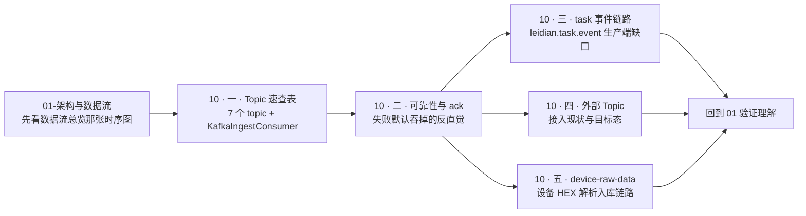

## 块2 [01-架构与数据流.md]

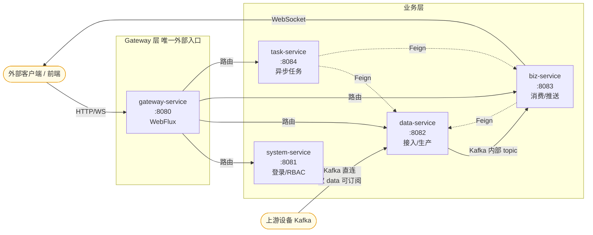

## 块3 [01-架构与数据流.md]

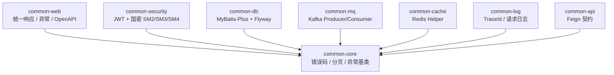

## 块4 [01-架构与数据流.md]

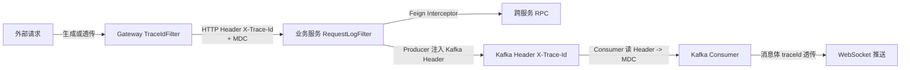

## 块5 [01-架构与数据流.md]

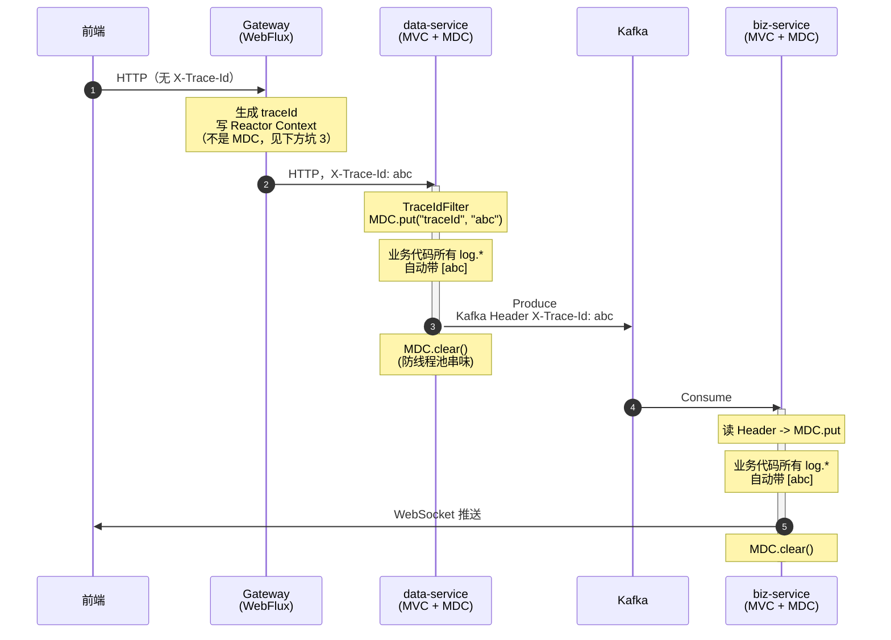

## 块6 [01-架构与数据流.md]

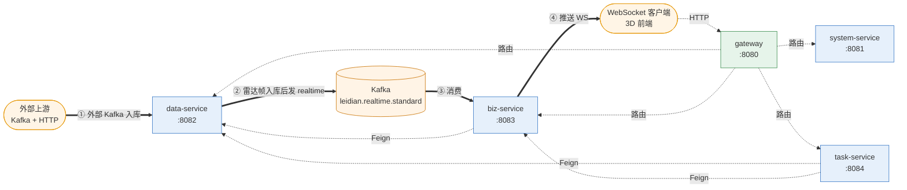

## 块7 [01-架构与数据流.md]

```mermaid
flowchart LR
  subgraph EXT["外部上游"]
    EXT_K["Kafka 外部 Topic<br/>cmb / locator / device-raw-data / radar-frame-upstream"]
  end

  subgraph DATA["data-service (8082)"]
    direction TB
    D_KCONS["KafkaIngestConsumer<br/>4 × @KafkaListener"]
    D_PROC["IngestProcessService"]
    D_RADAR["RadarFrameIngestService<br/>(radar-frame-upstream)"]
    D_PIPE["*StandardService<br/>Cmb / Locator / DeviceRaw"]
    D_STORE[("PostgreSQL<br/>data_raw_message / data_standard_message<br/>monitor_* / file_*")]
    D_PROD["RadarFrameInternalKafkaPublisher.publish"]
    D_RPCC["DataServiceRpcController<br/>/rpc/data/**"]
  end

  K_INT["Kafka<br/>leidian.realtime.standard"]

  subgraph BIZ["biz-service (8083)"]
    direction TB
    B_KCONS["RealtimeStandardConsumer"]
    B_HND["RealtimeMessageHandler"]
    B_PUSH["RadarFramePushService / RealtimePushService"]
    B_WS["WebSocket /realtime/ws"]
    B_RPCC["BizServiceRpcController"]
  end

  WS_CLI["WebSocket 客户端"]

  EXT_K --> D_KCONS
  D_KCONS -->|cmb/locator/device-raw| D_PROC --> D_PIPE --> D_STORE
  D_KCONS -->|radar-frame-upstream| D_RADAR --> D_STORE
  D_RADAR --> D_PROD --> K_INT --> B_KCONS --> B_HND --> B_PUSH --> B_WS --> WS_CLI
  D_STORE -.->|cmb/locator/device-raw 未发| D_PROD
```

## 块8 [01-架构与数据流.md]

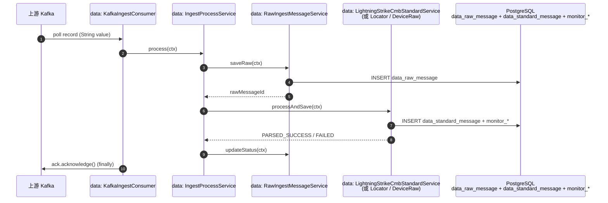

## 块9 [01-架构与数据流.md]

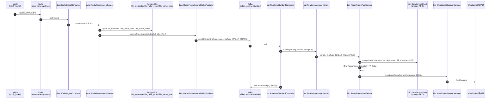

## 块10 [01-架构与数据流.md]

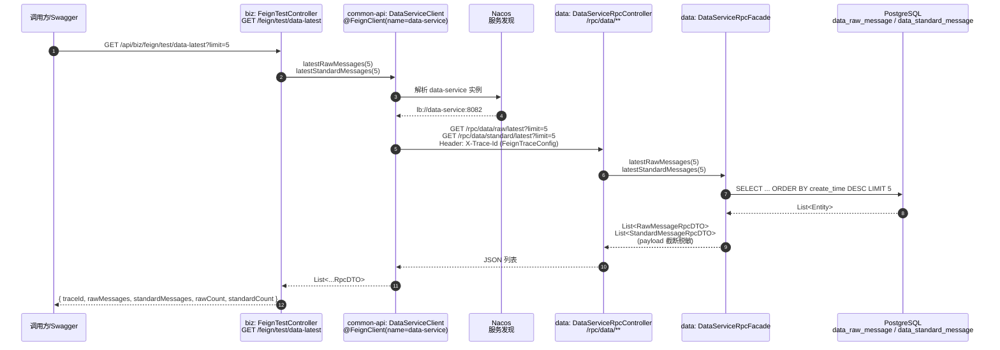

## 块11 [10-Kafka全链路.md]

```mermaid
flowchart TB
  subgraph PROD["生产侧：发送失败"]
    P1["业务方调用<br/>KafkaMessageProducer.send"]
    P2["kafkaTemplate.send 异步"]
    P3{"sendFuture.whenComplete<br/>ex == null ?"}
    P4["log.info 发送成功<br/>return KafkaSendResult.success=true"]
    P5["log.error 发送失败<br/>return KafkaSendResult.success=false"]
    P6["调用方（如测试 Controller）:<br/>捕获异常 -> 仅日志<br/>不回滚"]
    P1 --> P2 --> P3
    P3 -- success --> P4
    P3 -- fail --> P5 --> P6
  end

  subgraph CONS["消费侧：3 个 consumer 行为完全一致"]
    C1["@KafkaListener 拉取记录<br/>(AckMode.MANUAL)"]
    C2{"try { handle(record) }"}
    C3["业务成功<br/>ack.acknowledge()"]
    C4["catch (Exception e)<br/>log.error"]
    C5["ack.acknowledge() ← 仍然 ack"]
    C6"效果:<br/>• 消息不会重投<br/>• 不进 DLT<br/>• 不调用 RetryService"
    C1 --> C2
    C2 -- ok --> C3
    C2 -- 抛错 --> C4 --> C5 --> C6
  end

  subgraph RETRY["重试服务（占位）"]
    R1["RetryService.retry()"]
    R2["仅记 RETRY_PLACEHOLDER<br/>返回 'not implemented in P0'"]
    R1 --> R2
    R3"注意:<br/>• 没有任何调用方真正调用 retry()<br/>• 没有延迟队列<br/>• 没有 Kafka 重投"
  end

  subgraph FEIGN["Feign 调用容错（占位）"]
    F1["FeignClient 调用 (data/biz)"]
    F2{"feign.circuitbreaker.enabled?"}
    F3["true -> fallbackFactory 生效"]
    F4["false (当前默认) -><br/>直接抛 RetryableException / FeignException"]
    F1 --> F2
    F2 -- false --> F4
    F2 -- true --> F3
  end
```

## 块12 [10-Kafka全链路.md]

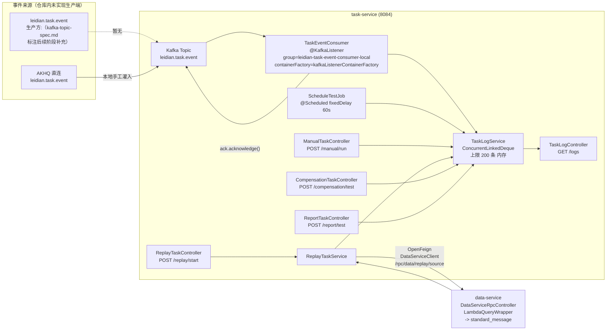

## 块13 [10-Kafka全链路.md]

```mermaid
flowchart TB
  EXT["上游 Kafka<br/>cmb / locator / device-raw-data / radar-frame-upstream"]
  CONS["KafkaIngestConsumer<br/>4 × @KafkaListener"]
  PROC["IngestProcessService.process"]
  RAW["RawIngestMessageService<br/>-> data_raw_message"]
  DISPATCH{"按 Topic 分支"}
  CMB["LightningStrikeCmbStandardService"]
  LOC["LightningStrikeLocatorStandardService"]
  DEV["DeviceRawStandardService<br/>拼帧 -> Parser -> Handler"]
  STORE[("data_standard_message + monitor_* / 设备 biz 表<br/>cmb/locator 雷击 / V5+V6 设备")]
  STATUS["RawIngestMessageService.updateStatus<br/>(finally 块内联)"]
  GAP["❌ cmb/locator/device-raw<br/>未发 internal Kafka"]
  RADAR["RadarFrameIngestService<br/>stat + 预签名 -> file 表"]
  PUB["✅ RadarFrameInternalKafkaPublisher<br/>-> leidian.realtime.standard"]
  BIZ["biz RealtimeMessageHandler<br/>RADAR_FRAME -> RadarFramePushService<br/>Redis + WebSocket 广播"]

  EXT --> CONS
  CONS -- "cmb/locator/device-raw" --> PROC --> RAW --> DISPATCH
  DISPATCH --> CMB --> STORE
  DISPATCH --> LOC --> STORE
  DISPATCH --> DEV --> STORE
  PROC --> STATUS
  STORE -.-> GAP
  CONS -- "radar-frame-upstream" --> RADAR --> PUB --> BIZ
```

## 块14 [10-Kafka全链路.md]

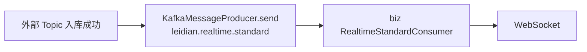

## 块15 [10-Kafka全链路.md]

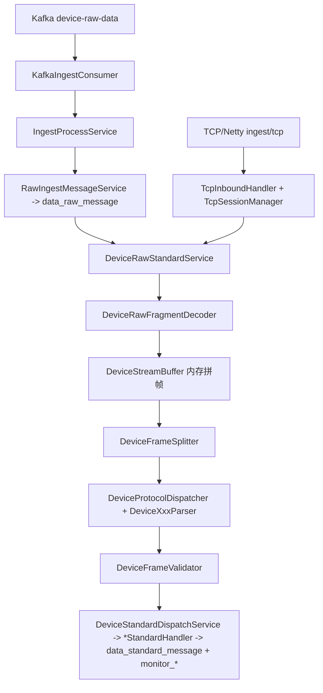

## 块16 [20-运维与部署.md]

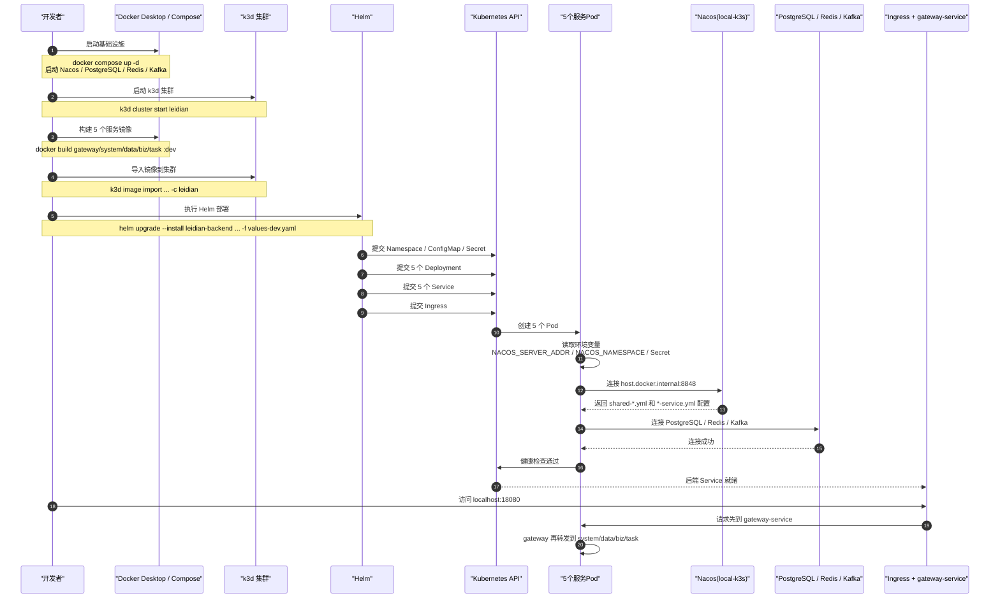

## 块17 [20-运维与部署.md]

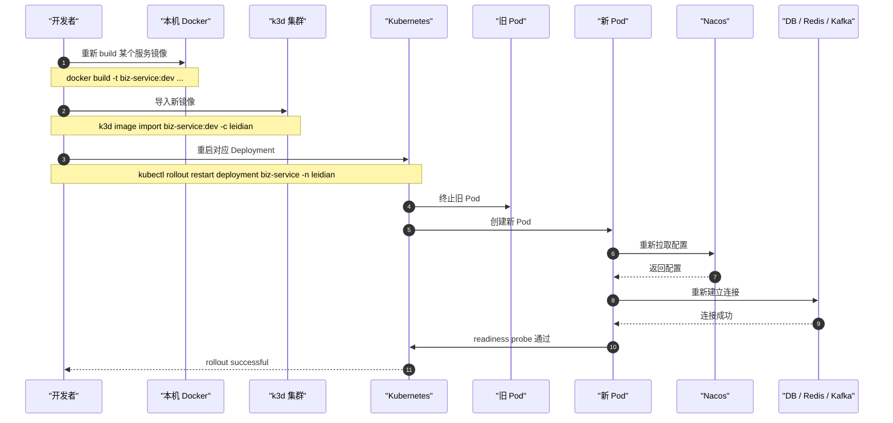

## 块18 [20-运维与部署.md]

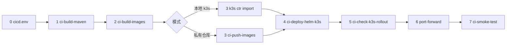

## 块19 [20-运维与部署.md]

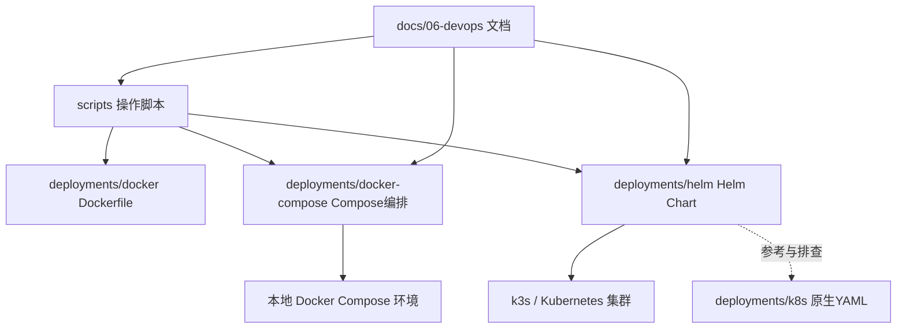

## 块20 [30-网关与配置.md]

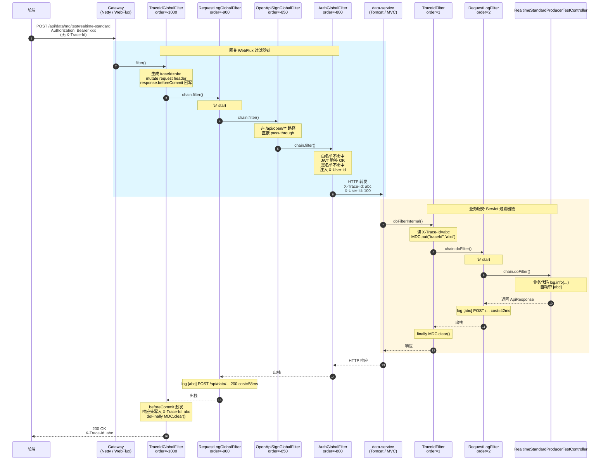

## 块21 [30-网关与配置.md]

```mermaid
sequenceDiagram
  autonumber
  participant U as 客户端
  participant GW as Gateway:8080<br/>(WebFlux)
  participant TR as TraceIdGlobalFilter<br/>order=-1000
  participant LG as RequestLogGlobalFilter<br/>order=-900
  participant AU as AuthGlobalFilter<br/>order=-800
  participant SP as StripPrefix=2
  participant SS as system-service:8081<br/>AuthController
  participant AS as AuthService
  participant DB as PostgreSQL<br/>sys_user
  participant RD as Redis

  Note over U,GW: 登录（白名单路径）
  U->>GW: POST /api/system/auth/login<br/>{username, password}
  GW->>TR: X-Trace-Id 透传/生成
  TR->>LG: pass
  LG->>AU: pass
  AU->>AU: WHITE_LIST 命中 /api/system/auth/login<br/>不查 token
  AU->>SP: pass
  SP->>SS: /auth/login
  SS->>AS: login(req)
  AS->>DB: selectOne(username)
  DB-->>AS: SysUser(passwordHash, passwordSalt, status)
  AS->>AS: GmPasswordEncoder.matches<br/>SM3(明文+salt+pepper)
  AS->>AS: JwtUtil.generateToken(userId, username, ["ADMIN"])<br/>HS256, jti=UUID, exp=now+2h
  AS->>RD: SET login:token:{userId} userId EX 7200
  AS-->>SS: token, "Bearer", 7200
  SS-->>U: 200 ApiResponse{ accessToken }

  Note over U,GW: 已鉴权请求
  U->>GW: GET /api/system/auth/userinfo<br/>Authorization: Bearer {token}
  GW->>TR: pass
  TR->>LG: pass
  LG->>AU: 提取 Bearer
  AU->>AU: JwtUtil.parseToken<br/>verifyWith(secretKey) + 解析 claims
  AU->>RD: EXISTS blacklist:token:{jti}
  RD-->>AU: 0 (不在黑名单)
  AU->>SP: pass
  SP->>SS: /auth/userinfo
  SS-->>U: 200 ApiResponse{ userId, username, roles }

  Note over U,GW: 登出 + 黑名单
  U->>GW: POST /api/system/auth/logout
  GW->>SS: /auth/logout
  SS->>AS: logout(authHeader)
  AS->>AS: parseToken -> userId, jti, exp
  AS->>RD: DEL login:token:{userId}
  AS->>RD: SET blacklist:token:{jti} "1" EX (exp-now)
  SS-->>U: 200

  Note over U,GW: 用旧 token 再访问
  U->>GW: GET /api/system/auth/userinfo<br/>Authorization: Bearer {旧token}
  GW->>AU: 验签通过<br/>但 EXISTS blacklist:token:{jti} = 1
  AU-->>U: 401 "token 已失效，请重新登录"
```

## 块22 [50-Common模块速查-8个公共库.md]

```mermaid
flowchart BT
  CORE[common-core]
  LOG[common-log]
  WEB[common-web]
  SEC[common-security]
  DB[common-db]
  MQ[common-mq]
  CACHE[common-cache]
  API[common-api]

  LOG --> CORE
  WEB --> CORE
  WEB --> LOG
  SEC --> CORE
  CACHE --> CORE
  DB --> CORE
  MQ --> CORE
  API --> CORE

  subgraph SVC["业务服务"]
    GW[gateway-service]
    SYS[system-service]
    DAT[data-service]
    BIZ[biz-service]
    TSK[task-service]
    DBMIG[db-migration]
  end

  GW --> SEC
  GW --> CACHE
  GW --> CORE
  SYS --> WEB
  SYS --> SEC
  SYS --> DB
  SYS --> CACHE
  DAT --> WEB
  DAT --> DB
  DAT --> MQ
  DAT --> CACHE
  DAT --> API
  BIZ --> WEB
  BIZ --> MQ
  BIZ --> CACHE
  BIZ --> API
  TSK --> WEB
  TSK --> MQ
  TSK --> API
  DBMIG --> CORE
```

