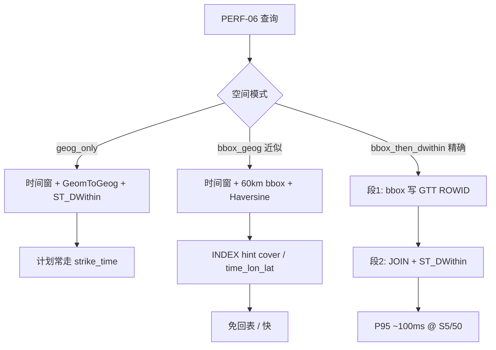

# 02 — 分阶段优化过程

按时间与因果顺序记录。每阶段写清：**现象 → 动作 → 结论**。

---

## 阶段 A — 压测启动上下文加速

### 现象

日志已出现「解析压测上下文（快速模式…）」仍要等很久；或清理阶段无日志却长时间无响应。

### 动作

文件：`python/generators/dameng_sql_bench.py`

1. **禁止大表 COUNT/DISTINCT/MAX**  
   - 设备列表：读 `config/mine-sites.yaml`  
   - 有无数据：`EXISTS` + `ROWNUM <= 1`  
   - PERF-04 时间窗：改用过程 `data_window` 末尾，不再 `MAX(device_upload_time)`
2. **按 scenarios 跳过探活**  
   - 仅 PERF-06：跳过大气/raw 探活  
3. **只读场景跳过写入清理**  
   - 避免对大表按标记 `COUNT`/`EXISTS` 全扫  
4. **分步耗时日志** `[1/4]`～`[4/4]`

### 结论

只跑 PERF-06 时，上下文应在秒级完成；若仍慢，看分步日志定位。

---

## 阶段 B — 页面可选 PERF-06 空间模式

### 现象

模式只能靠 `export DM_PERF06_GEO=bbox_geog`，操作台不直观，且不易在结果里对照。

### 动作

| 层 | 改动 |
|----|------|
| UI | `web/index.html` 增加「PERF-06空间」下拉（达梦可见） |
| 前端 | `web/app.js` 提交 `perf06Geo` |
| API | `web/server.py` → `run_sql_benchmark_dameng(perf06_geo=...)` |
| 核心 | `BenchContext.perf06_geo_mode` + `normalize_perf06_geo_mode()` |
| CLI | `run_load.py --perf06-geo` |

可选值：

- `geog_only`（默认）：`GeomToGeog + ST_DWithin`
- `bbox_geog`：后续演进为 bbox + Haversine + 索引 hint（见阶段 D/E）

### 结论

A/B 可在页面一键切换；日志打印 `PERF-06 空间模式: ...`。

---

## 阶段 C — 发现：ST_DWithin 导致复合索引 hint 失效

### 现象

`bbox_geog` 已带 lon/lat `BETWEEN`，且存在 `idx_biz_lightning_time_lon_lat`，EXPLAIN 仍是：

```text
SSEK2 … idx_biz_lightning_strike_time
SLCT2 … (longitude BETWEEN … AND ST_DWithin …)
```

尝试过：

- `/*+ INDEX(alias|table idx_biz_lightning_time_lon_lat) */`
- 子查询拆分内外层
- `NO_MERGE` / `NO_INDEX(strike_time)` / `ROWNUM` 物化屏障  

**只要同一语句含 `ST_DWithin`，复合索引 hint 基本无效。**

### 对照实验（同过程窗，单会话）

| SQL 形态 | 计划索引 | count 结果 |
|----------|----------|------------|
| 时间 + ST_DWithin | `strike_time` | 451 |
| 时间 + bbox + INDEX hint（无地理函数） | **`time_lon_lat`** | 477（仅 60km 框，略多） |
| 时间 + bbox + Haversine≤50km + INDEX | **`time_lon_lat`** | **451**（与 ST_DWithin 一致） |

### 结论

达梦上「业务精确 Geography」与「压测可走 B-tree 复合索引」冲突；bbox 压测路径改用 **Haversine 精算**（本窗与 ST_DWithin 计数一致），才能吃到复合索引。

---

## 阶段 D — bbox_geog = 复合索引 + bbox + Haversine

### 动作

`dameng_sql_bench.py` 中 bbox 模式改为：

```sql
SELECT /*+ INDEX(biz_lightning_event idx_biz_lightning_time_lon_lat) */
       ...
WHERE strike_time 窗
  AND lon/lat BETWEEN 60km 框
  AND Haversine(lon,lat,圆心) <= 50000
```

`geog_only` 保持原 ST_DWithin，作为业务语义对照。

### 复测 `b3dc92f7`（conc=50）

| 子场景 | P95 | 说明 |
|--------|-----|------|
| count | **40ms** | 成功 |
| source_dist | 419ms | GROUP BY 仍慢 |
| type_dist | 429ms | 同上 |

单线程三条子句均约 11～13ms；并发后仅 GROUP BY 恶化。

### 结论

过滤层优化完成；瓶颈转为 **GROUP BY 回表（BLKUP2）**。

---

## 阶段 E — 覆盖索引消除 GROUP BY 回表

### 动作

新增索引（DDL + 现网补建）：

```sql
CREATE INDEX IF NOT EXISTS idx_biz_lightning_perf06_cover
ON biz_lightning_event (
  strike_time, longitude, latitude, source_type, lightning_type
);
```

落点：

- `sql-dameng/03_partitioned_tables.sql`
- `sql-dameng/optional_perf06_bbox_index.sql`（已建库补建）
- `sql-postgres/03_partitioned_tables.sql`（双方言对齐）

bbox_geog hint 统一改为：

```text
/*+ INDEX(biz_lightning_event idx_biz_lightning_perf06_cover) */
```

保留 `idx_biz_lightning_time_lon_lat`（已构建；count 优化器仍可能选用更短索引）。

### EXPLAIN 验证

| 子场景 | 索引 | BLKUP2 |
|--------|------|--------|
| count | 常为 `time_lon_lat` | 无 |
| source_dist | **`perf06_cover`** | **无** |
| type_dist | **`perf06_cover`** | **无** |

### 复测 `6f506ab0`（conc=50）

三条 P95 均约 **40～41ms**，TPS≈1500，CPU peak 从 ~96% 降到个位数～十余。详见 [03-before-after-results.md](./03-before-after-results.md)。

### 结论

覆盖索引达到预期；PERF-06 **近似** bbox 路径在 S5/50 并发下达标。  
业务精确口径仍见后续阶段 G。

---

## 阶段 F — 修正资源采集 EXPLAIN（Haversine 轮）

### 动作

`python/generators/dameng_explain_collect.py`：

1. **优先**使用压测结果里的 `sqlPreview` 做 `EXPLAIN FOR`  
2. 若无预览，再 builder 生成，并根据预览推断 `perf06_geo_mode`（`BETWEEN+ASIN` → bbox_geog）

### 结论

配套采集计划与真实压测 SQL 一致（Haversine 轮可见 `perf06_cover` / `time_lon_lat`）。

---

## 阶段 G — 两段式 bbox_then_dwithin（精确）

### 现象

业务需 `ST_DWithin`；`geog_only` @ conc=50 P95≈450ms。同句 bbox+ST_DWithin 无效（阶段 C）。

### 动作

新增模式 `bbox_then_dwithin`：

1. `INSERT INTO perf06_cand_rowid SELECT /*+ INDEX(cover) */ ROWID … WHERE 时间+bbox`  
2. `JOIN GTT + ST_DWithin` 做 count / GROUP BY  

真两次 execute；会话 GTT `ON COMMIT PRESERVE ROWS`；每 op DELETE 清空。  
详见 [06-two-phase-bbox-then-dwithin.md](./06-two-phase-bbox-then-dwithin.md)、[05-haversine-vs-stdwithin.md](./05-haversine-vs-stdwithin.md)。

### 复测

| runId | P95（三条） | 说明 |
|-------|-------------|------|
| `e4c6b60a` | ~95～97ms | 仅 PERF-06 |
| `b59ea1a8` | ~96～98ms | 全场景验收中的 PERF-06 |

相对 geog_only 约 **4～5×**；语义仍精确。

### 结论

精确口径下推荐 `bbox_then_dwithin`；`bbox_geog` 仅作近似极限对照。

---

## 阶段 H — 两段式 EXPLAIN 采集修复

预览头 `-- perf06_geo_mode=…` 与语句被拼成单行后，`--` 注释掉整句 → `-2007`。  
修复：剥行注释；两段式只 EXPLAIN 第 1 段 `SELECT ROWID`。重启操作台后再采集。

---

## 技术要点摘要



| 原则 | 说明 |
|------|------|
| 大表禁止启动期 COUNT/DISTINCT/MAX | 用配置 + EXISTS + 过程窗 |
| 同句 ST_DWithin 与 B-tree 复合索引不兼容 | 精确路径必须真拆段或接受 geog_only |
| GROUP BY 要覆盖聚合列 | 否则 BLKUP 在高并发下放大（Haversine 路径） |
| EXPLAIN 必须用压测同款 SQL，且勿被 `--` 注释污染 | 否则结论不可信 |
| 压测近似 ≠ 业务承诺 | Haversine 40ms 不能直接写进业务 SLA |